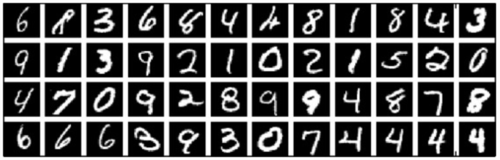

# MNIST手写识别

## 背景

MNIST可以说是图像识别领域的“Hello World！”。它是Google实验室的Corinna Cortes和纽约大学柯朗研究所的Yann LeCun创建的一个手写数字数据库，每个样本数据是一张28x28像素的灰度手写数字图片，每张图片对应一个数字，训练库有60,000张手写数字图像，测试库有10,000张。

可以看到，有少数图片扭曲的很厉害。

## 描述任务

问题：

- 60000个训练样本，10000个测试样本，每个样本是一张28\*28的灰度图片
- 0-9，10个数字类别

目标：训练模型，识别图片中的数字。