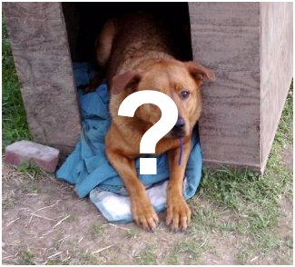

# 猫狗分辨

## 背景

Kaggle是一个很棒的机器学习任务平台，有丰富的学习资源以及优秀的team。下面从Kaggle发布的任务中挑选了一个适合本章主题的任务：Dogs vs Cats（猫狗分类）。猫狗分类的数据集是从网络爬取得若干猫或者狗的图片，目标是识别中图片的动物是猫还是狗。

## 描述任务

二分类问题，给定一张图片，辨别图片中的猫狗。

从 [这里](https://www.kaggle.com/c/dogs-vs-cats/data) 下载训练集train.zip，将其解压到../data/dog_cat/train/目录下。我们并不打算用全部的样本集（因为那样模型训练速度在单机上不可接受），所以只从训练集中抽取一部分样本作为实验数据。